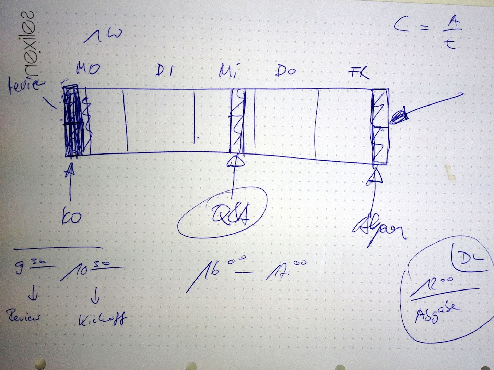

===============
Ausbildungsplan
===============

:Autor:  nexiles GmbH
:Datum:  24.09.2012

Einleitung
==========

Wie soll die Ausbildung geplant und organisiert werden?

Wochenplanung
=============

+-----------+-----------------------------------------------------+
| Wochentag | Termin                                              |
+===========+=====================================================+
| Montag    | Das Ausbildungsthema der letzten Woche wird gepüft  |
+-----------+-----------------------------------------------------+
| Dienstag  | --                                                  |
+-----------+-----------------------------------------------------+
| Mittwoch  | Q&A: Fragen zum aktuellen Ausbildungsthema können   |
|           | beantwortet werden. Wissensstand wird geprüft       |
+-----------+-----------------------------------------------------+
| Donnersta | --                                                  |
| g         |                                                     |
+-----------+-----------------------------------------------------+
| Freiag    | Abgabetermin der schriftlichen Ausarbeitung zum     |
|           | aktuellen Lernthema                                 |
+-----------+-----------------------------------------------------+

Output der Besprechung vom 24.09.2012

.. vim: set ft=rst ts=4 sw=4 expandtab tw=78 :

