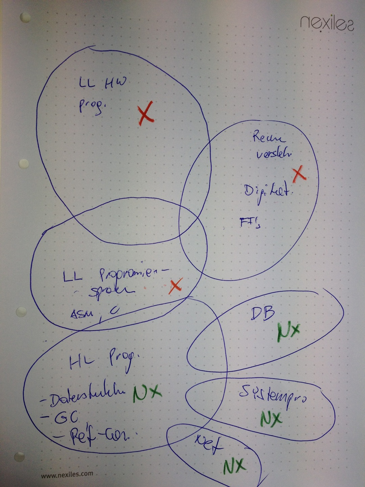

=================
Ausbildungsthemen
=================

:Autor:  nexiles GmbH
:Datum:  03.09.2012

Einleitung
==========

Wie können bestimmte Lerneinheiten vermittelt werden, damit sie aufeinander
aufbauen?

Welche Themen werden wann geplant?

Organisation Themen
===================

Output der Besprechung vom 03.09.2012

Mögliche Projekt Themen und Überschneidungen:

.. vim: set ft=rst ts=4 sw=4 expandtab tw=78 :
