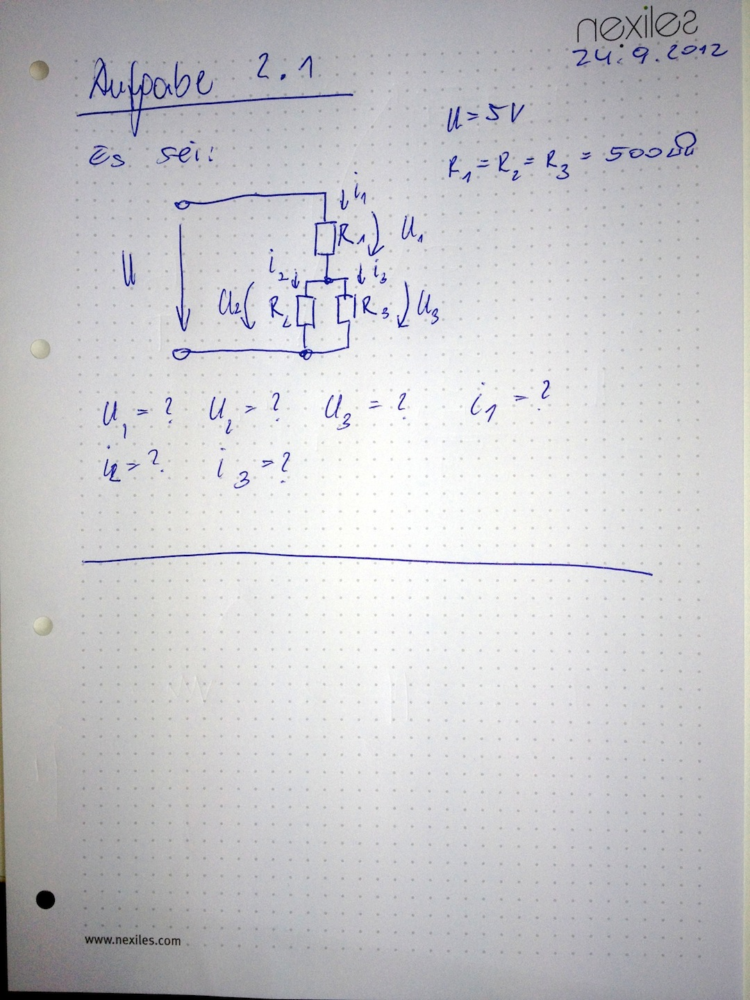

===========
Aufgabe 2.1
===========

:Autor:  nexiles GmbH
:Datum:  24.09.2012

Einleitung
==========

Diese Aufgabe bezieht sich auf das Themengebiet:

    :ref:`2_elektronik`

Voraussetzung
=============

Folgende Konzepte müssen verstanden und ausgearbeitet werden:

    - Spannung

    - Strom

    - Widerstand

    - Leitwert

    - Parallelschaltung

    - Serienschaltung

Aufgabe
=======

Berechne die fehlenden Größen:

.. vim: set ft=rst ts=4 sw=4 expandtab tw=78 :
